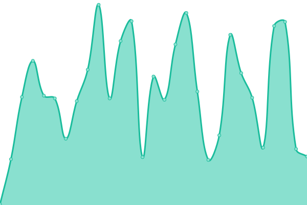
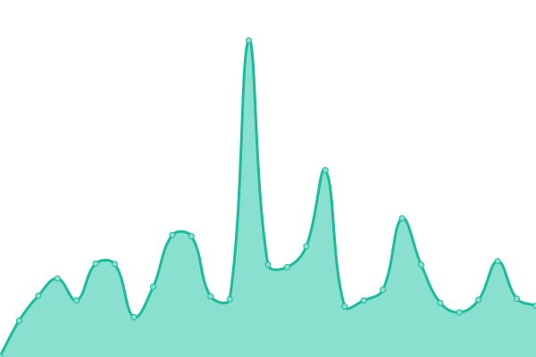
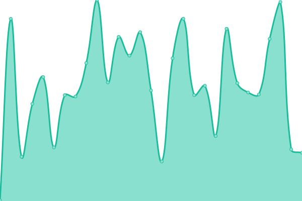
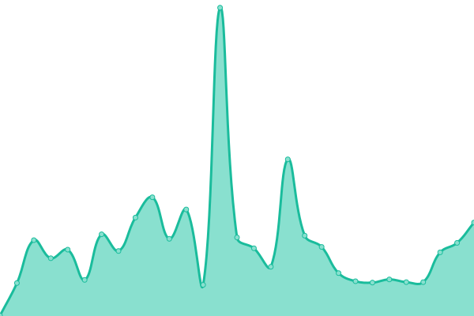
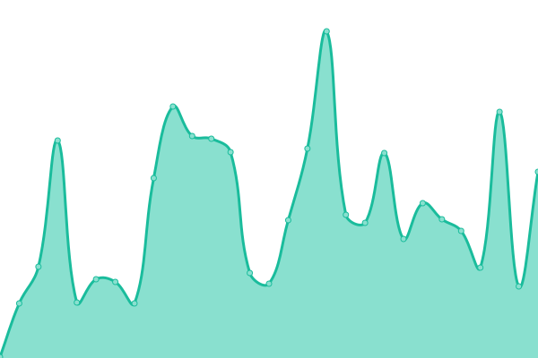
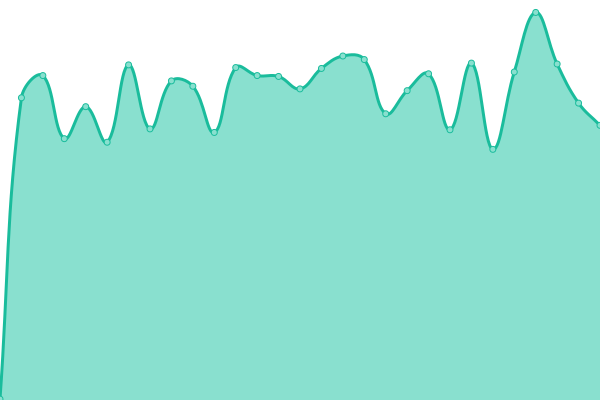

# [📈 Live Status](https://up.51sec.org): <!--live status--> **🟧 Partial outage**

This repository contains the open-source uptime monitor and status page for [51sec](https://up.51sec.org), powered by [Upptime](https://github.com/upptime/upptime).

With [Upptime](https://upptime.js.org), you can get your own unlimited and free uptime monitor and status page, powered entirely by a GitHub repository. We use [Issues](https://github.com/51sec/up/issues) as incident reports, [Actions](https://github.com/51sec/up/actions) as uptime monitors, and [Pages](https://up.51sec.org) for the status page.

<!--start: status pages-->
<!-- This summary is generated by Upptime (https://github.com/upptime/upptime) -->
<!-- Do not edit this manually, your changes will be overwritten -->
<!-- prettier-ignore -->
| URL | Status | History | Response Time | Uptime |
| --- | ------ | ------- | ------------- | ------ |
|  [Blog](https://blog.51sec.org) | 🟥 Down | [blog.yml](https://github.com/51sec/up/commits/HEAD/history/blog.yml) | 

 210ms
     
 | 

<a href="https://up.51sec.org/history/blog">0.00%</a>
    

|  [WWW](https://www.51sec.org) | 🟥 Down | [www.yml](https://github.com/51sec/up/commits/HEAD/history/www.yml) | 

 240ms
     
 | 

<a href="https://up.51sec.org/history/www">0.00%</a>
    

|  [ITPROSEC](https://www.itprosec.com) | 🟥 Down | [itprosec.yml](https://github.com/51sec/up/commits/HEAD/history/itprosec.yml) | 

 160ms
     
 | 

<a href="https://up.51sec.org/history/itprosec">0.00%</a>
    

|  [Sites](https://sites.51sec.org) | 🟥 Down | [sites.yml](https://github.com/51sec/up/commits/HEAD/history/sites.yml) | 

 226ms
     
 | 

<a href="https://up.51sec.org/history/sites">0.00%</a>
    

|  [Navigation](https://nav.51sec.org) | 🟥 Down | [navigation.yml](https://github.com/51sec/up/commits/HEAD/history/navigation.yml) | 

 180ms
     
 | 

<a href="https://up.51sec.org/history/navigation">0.00%</a>
    

|  [OneDrive](https://od.51sec.org) | 🟥 Down | [one-drive.yml](https://github.com/51sec/up/commits/HEAD/history/one-drive.yml) | 

 210ms
     
 | 

<a href="https://up.51sec.org/history/one-drive">0.00%</a>
    

|  [GDDrive](https://gd.51sec.org) | 🟥 Down | [gd-drive.yml](https://github.com/51sec/up/commits/HEAD/history/gd-drive.yml) | 

 225ms
     
 | 

<a href="https://up.51sec.org/history/gd-drive">0.00%</a>
    

|  [ARMWP](https://armwp.51sec.org) | 🟥 Down | [armwp.yml](https://github.com/51sec/up/commits/HEAD/history/armwp.yml) | 

 199ms
     
 | 

<a href="https://up.51sec.org/history/armwp">0.00%</a>
    

|  [NetSec YouTube Channel](https://www.youtube.com/c/NetSec) | 🟩 Up | [net-sec-you-tube-channel.yml](https://github.com/51sec/up/commits/HEAD/history/net-sec-you-tube-channel.yml) | 

 324ms
     
 | 

<a href="https://up.51sec.org/history/net-sec-you-tube-channel">100.00%</a>
    

|  [Google DNS 8.8.8.8](8.8.8.8) | 🟩 Up | [google-dns-8-8-8-8.yml](https://github.com/51sec/up/commits/HEAD/history/google-dns-8-8-8-8.yml) | 

 4ms
     
 | 

<a href="https://up.51sec.org/history/google-dns-8-8-8-8">100.00%</a>
    

<!--end: status pages-->

[**Visit our status website →**](https://up.51sec.org)

## 📄 License

- Powered by: [Upptime](https://github.com/upptime/upptime)
- Code: [MIT](./LICENSE) © [51sec](https://up.51sec.org)
- Data in the `./history` directory: [Open Database License](https://opendatacommons.org/licenses/odbl/1-0/)
